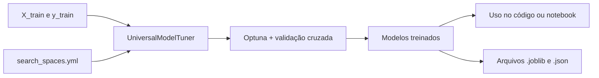

# ML Blueprint

O ML Blueprint disponibiliza uma classe reutilizável para otimizar e treinar modelos de machine learning com scikit-learn e [Optuna](https://optuna.org/).

A classe [`UniversalModelTuner`](src/universal_model_tuner.py) pode ser usada em qualquer fluxo Python: um script, um notebook, uma aplicação ou outro módulo. O arquivo `main.py` é somente um exemplo de uso e não é obrigatório para utilizar o tuner.

## O que a classe faz

Ao chamar `tune_and_fit_all_models()`, o tuner:

1. Lê os modelos e espaços de busca em `configs/search_spaces.yml`.
2. Testa combinações de hiperparâmetros usando Optuna.
3. Avalia cada combinação com validação cruzada.
4. Treina novamente o melhor modelo usando todos os dados de treino.
5. Guarda os modelos treinados e seus melhores parâmetros em `outputs/`.



## Instalação

O projeto requer Python 3.9 ou superior. Instale as dependências do arquivo [`requirements.txt`](requirements.txt):

```powershell
python -m pip install -r requirements.txt
```

## Uso em qualquer código Python

Você só precisa fornecer `X_train` e `y_train`. Eles podem ser DataFrames, Series, arrays NumPy ou qualquer formato aceito pelos estimadores do scikit-learn.

```python
from src.universal_model_tuner import UniversalModelTuner

tuner = UniversalModelTuner(
		X_train=X_train,
		y_train=y_train,
		scenario_name="meu_experimento",
		n_trials=20,
		scorer="accuracy",
		cv=5,
)

tuner.tune_and_fit_all_models()

# Acessa um modelo treinado pelo nome definido no YAML.
modelo_knn = tuner.fitted_models["KNN"]["model"]
predicoes = modelo_knn.predict(X_novos)
```

O dicionário `tuner.fitted_models` guarda, para cada modelo, o estimador ajustado, o estudo do Optuna e os melhores parâmetros:

```python
modelo = tuner.fitted_models["DecisionTree"]["model"]
melhores_parametros = tuner.fitted_models["DecisionTree"]["params"]
estudo = tuner.fitted_models["DecisionTree"]["study"]
```

## Uso em um notebook

O tuner não depende do `main.py`. Em uma célula do Jupyter, carregue os dados da forma que fizer sentido para o seu experimento e passe-os para a classe:

```python
import pandas as pd
from src.universal_model_tuner import UniversalModelTuner

X_train = pd.read_csv("data/processed/X_train.csv")
y_train = pd.read_csv("data/processed/y_train.csv").squeeze()

tuner = UniversalModelTuner(X_train, y_train, "experimento_notebook")
tuner.tune_and_fit_all_models()

modelo = tuner.fitted_models["KNN"]["model"]
modelo.score(X_train, y_train)
```

O mesmo padrão pode ser usado em um pipeline, em um serviço ou em um script próprio. O ponto importante é importar `UniversalModelTuner`, criar uma instância e chamar o método de treinamento.

## Configuração dos modelos

Os modelos são configurados em [`configs/search_spaces.yml`](configs/search_spaces.yml). Cada cenário possui:

| Campo | Descrição |
| --- | --- |
| `model_class` | Caminho completo da classe do estimador |
| `model_name` | Nome usado no dicionário de resultados e nos arquivos exportados |
| `hyperparameters` | Hiperparâmetros que serão explorados pelo Optuna |

Exemplo:

```yaml
decision_tree_scenario:
	model_class: "sklearn.tree.DecisionTreeClassifier"
	model_name: "DecisionTree"
	hyperparameters:
		max_depth:
			type: "int"
			low: 2
			high: 10
		criterion:
			type: "categorical"
			choices: ["gini", "entropy"]
```

Tipos suportados:

- `int`, com `low` e `high`.
- `float`, com `low`, `high` e opcionalmente `log: true`.
- `categorical`, com `choices`.

Para adicionar outro estimador, inclua um novo cenário no YAML e use o caminho completo da classe. O tuner importa a classe automaticamente.

## Modelos e logs gerados

Os arquivos são criados automaticamente depois do treinamento:

```text
outputs/
├── models/
│   ├── meu_experimento_KNN_best.joblib
│   └── meu_experimento_DecisionTree_best.joblib
└── logs/
		├── meu_experimento_KNN_info.json
		└── meu_experimento_DecisionTree_info.json
```

Os modelos podem ser carregados em qualquer outro script ou notebook:

```python
import joblib

modelo = joblib.load("outputs/models/meu_experimento_KNN_best.joblib")
predicoes = modelo.predict(X_novos)
```

Os arquivos JSON registram o cenário, o nome do modelo e os melhores hiperparâmetros encontrados.

## Parâmetros principais

```python
UniversalModelTuner(
		X_train,          # Dados de entrada para treino e validação
		y_train,          # Valores-alvo
		scenario_name,    # Prefixo dos arquivos exportados
		n_trials=10,      # Tentativas do Optuna por modelo
		scorer="accuracy",# Métrica do scikit-learn
		cv=3,              # Número de divisões da validação cruzada
)
```

O `random_state` é definido como `14` automaticamente quando o estimador oferece esse parâmetro.

## Estrutura do projeto

```text
.
├── configs/
│   └── search_spaces.yml
├── data/
│   ├── processed/
│   └── raw/
├── outputs/
│   ├── logs/
│   ├── models/
│   └── predictions/
├── src/
│   └── universal_model_tuner.py
├── main.py                    # Exemplo opcional de execução
└── requirements.txt
```

## Observações

- O arquivo de configuração é localizado a partir da raiz do projeto, independentemente do diretório a partir do qual o código é chamado.
- O modelo final de cada configuração é treinado com todos os dados recebidos em `X_train` e `y_train`.
- O tuner não calcula métricas no conjunto de teste automaticamente; essa avaliação pode ser feita depois usando o modelo armazenado em `fitted_models`.
- O `main.py` usa os CSVs de `data/processed/` apenas como demonstração. Você pode substituí-lo por qualquer outra forma de carregar e preparar seus dados.
