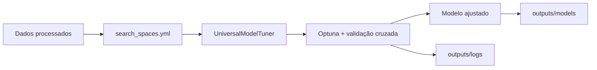

# ML Blueprint

Um framework simples e extensível para otimização automática de modelos de machine learning com [Optuna](https://optuna.org/) e scikit-learn.

O projeto lê os espaços de busca definidos em YAML, executa validação cruzada para encontrar os melhores hiperparâmetros, treina cada modelo vencedor com os dados completos de treino e exporta os artefatos para reutilização.

## Fluxo do projeto



## Requisitos

- Python 3.9 ou superior
- Dados de treino no formato CSV
- Dependências Python:

```powershell
python -m pip install pandas pyyaml optuna scikit-learn joblib
```

## Como executar

1. Clone o repositório e acesse a pasta do projeto.
2. Instale as dependências.
3. Garanta que os arquivos abaixo existam em `data/processed/`:

```text
X_train.csv
y_train.csv
X_test.csv
y_test.csv
```

4. Execute o treinamento:

```powershell
python main.py
```

O script usa o cenário `testes`, realiza 10 tentativas por modelo e avalia os candidatos com `accuracy` e validação cruzada com 3 divisões.

## Configuração dos modelos

Os modelos são definidos em [`configs/search_spaces.yml`](configs/search_spaces.yml). Cada entrada precisa informar:

| Campo | Descrição |
| --- | --- |
| `model_class` | Caminho completo da classe Python do estimador |
| `model_name` | Nome usado nos arquivos exportados |
| `hyperparameters` | Hiperparâmetros que serão explorados pelo Optuna |

Exemplo:

```yaml
decision_tree_scenario:
	model_class: "sklearn.tree.DecisionTreeClassifier"
	model_name: "DecisionTree"
	hyperparameters:
		max_depth:
			type: "int"
			low: 2
			high: 10
		criterion:
			type: "categorical"
			choices: ["gini", "entropy"]
```

Tipos de hiperparâmetros suportados:

- `int`, com `low` e `high`
- `float`, com `low`, `high` e opcionalmente `log: true`
- `categorical`, com `choices`

## Artefatos gerados

Depois da execução, os resultados ficam em:

```text
outputs/
├── models/
│   ├── testes_KNN_best.joblib
│   └── testes_DecisionTree_best.joblib
└── logs/
		├── testes_KNN_info.json
		└── testes_DecisionTree_info.json
```

Os arquivos `.joblib` contêm os modelos treinados. Os arquivos `.json` registram o cenário, o nome do modelo e os melhores hiperparâmetros encontrados.

Para carregar um modelo salvo:

```python
import joblib

modelo = joblib.load("outputs/models/testes_KNN_best.joblib")
predicoes = modelo.predict(X_novos)
```

## Estrutura

```text
.
├── configs/
│   └── search_spaces.yml
├── data/
│   ├── processed/
│   └── raw/
├── outputs/
│   ├── logs/
│   ├── models/
│   └── predictions/
├── src/
│   └── universal_model_tuner.py
└── main.py
```

## Uso como biblioteca

Também é possível usar o tuner diretamente no código:

```python
from src.universal_model_tuner import UniversalModelTuner

tuner = UniversalModelTuner(
		X_train=X_train,
		y_train=y_train,
		scenario_name="meu_cenario",
		n_trials=20,
		scorer="accuracy",
		cv=5,
)

tuner.tune_and_fit_all_models()
modelo_knn = tuner.fitted_models["KNN"]["model"]
```

## Observações

- Um `random_state` fixo (`14`) é aplicado automaticamente aos estimadores que oferecem esse parâmetro.
- O modelo final de cada configuração é treinado usando todos os dados de `X_train` e `y_train`.
- Os arquivos de teste são carregados pelo `main.py`, mas ainda não são usados para calcular métricas ou gerar predições.
- Os diretórios de saída são criados automaticamente quando necessário.

## Próximos passos

- Adicionar as dependências ao `requirements.txt`.
- Avaliar os melhores modelos no conjunto de teste.
- Persistir métricas adicionais, como precisão, recall e F1-score.
- Adicionar testes automatizados para o carregamento das configurações e exportação dos artefatos.
